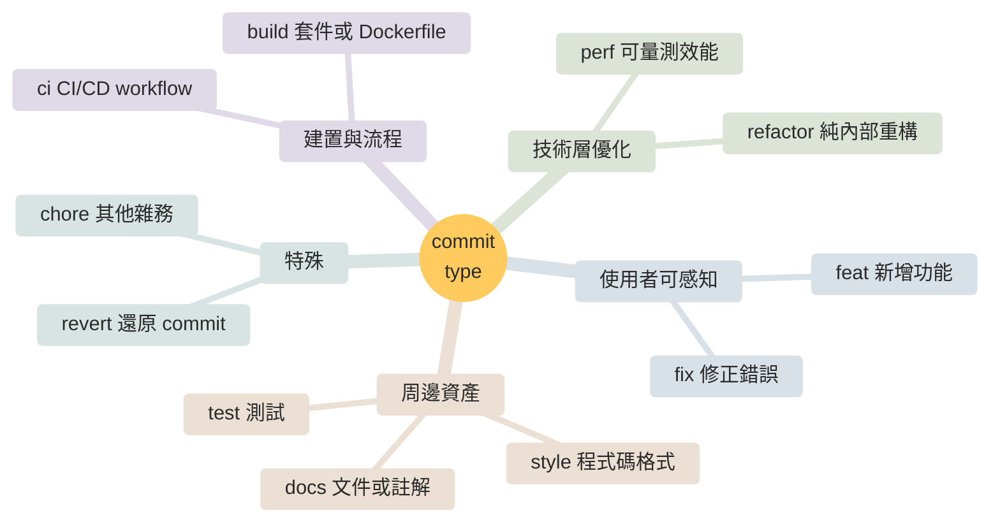

# Commit Tags

本文件定義 Prinsur 三個主要 repo（prinsur-web、prinsur-api、prinsur-ai）可使用的 commit type（tag）清單。

嚴格遵守 [Conventional Commits v1.0.0](https://www.conventionalcommits.org/en/v1.0.0/) 規範，採用 [`@commitlint/config-conventional`](https://github.com/conventional-changelog/commitlint/tree/master/@commitlint/config-conventional) 的 11 個預設 type，**禁止自行新增 type**。

## Quick Decision Tree



> 若變更同時符合多個分類，依 [Multi-Type Commits](#multi-type-commits) 章節的優先順序裁決（`breaking > feat > fix > perf > refactor > 其他`）。

## Format

```
<type>(<scope>): <subject>

<body>

<footer>
```

### Length & Whitespace Rules

- **Subject**：硬上限 100 字元（對齊 `@commitlint/config-conventional`）；理想 ≤ 72 字元（可在 `git log --oneline`、GitHub PR 列表完整顯示不被截斷）。
- **Body 每行**：硬上限 100 字元；URL 例外可超過。建議盡量維持傳統 72 字元慣例以利 `git log` 預設 pager 閱讀。
- **空行規則**（Git 硬性要求，缺一則 `git rebase` / `git interpret-trailers` 可能誤判）：
  - Subject 與 body 之間**必須**空一行
  - Body 與 footer 之間**必須**空一行
  - 無 body 時 footer 可直接接在 subject 後一行空行

### Fields

- `<type>`：必填，只能從下方 11 個允許清單中挑選。
- `<scope>`：建議必填，選用見 [commit-scopes.md](./commit-scopes.md)。跨多個 scope 時可省略。
- `<subject>`：祈使句（imperative mood）、小寫開頭、句尾不加句號，使用英文。
- `<body>`：選填。使用中文撰寫，說明「為什麼」而非「做了什麼」。
- `<footer>`：選填。Git trailers 格式，詳見下節。

### Footer（Git Trailers）

Footer 採用 Git trailers 語法（見 [git-interpret-trailers](https://git-scm.com/docs/git-interpret-trailers)），每行格式為 `Token: value`，token 使用 kebab-case。

**支援 token：**

| Token | 用途 | 範例 |
|---|---|---|
| `Closes` | 關聯並自動關閉 GitHub PR / issue | `Closes #42` |
| `Fixes` | 關聯並自動關閉 bug issue | `Fixes #123` |
| `Refs` | 純引用不關閉 | `Refs: PRAI-12` |
| `Co-authored-by` | 多作者（**禁止用於 Claude 或任何 AI**） | `Co-authored-by: Alice <alice@x.com>` |
| `BREAKING CHANGE` | 破壞性變更說明（唯一允許空格大寫的 token） | `BREAKING CHANGE: drop /v1 endpoint` |
| `DEPRECATED` | 功能棄用標記（Angular 慣例） | `DEPRECATED: useLegacyHook will be removed in v2` |

**Linear 與 GitHub 的區分：** 本專案 issue 在 Linear、PR 在 GitHub。

- GitHub PR / issue → 用 `Closes #N` / `Fixes #N`（GitHub 會自動關閉）
- Linear issue（如 `PRAI-12`） → 用 `Refs: PRAI-12`

### Breaking Changes

兩種表達方式，擇一即可，**兩者並用更清楚**：

- 在 type 後加 `!`：`feat(chat)!: drop legacy SSE format`
- 在 footer 加 `BREAKING CHANGE:` 段落說明影響與遷移方式。

**Token 拼法：** Conventional Commits spec 同時允許 `BREAKING CHANGE:`（空格）與 `BREAKING-CHANGE:`（hyphen）兩種寫法。**本專案統一使用 `BREAKING CHANGE:` 空格版本**，避免解析器差異。這是本專案唯一允許 footer token 含空格的例外。

範例：
```
feat(api)!: unify timestamp format to RFC 3339

說明遷移原因、影響的 endpoint、測試策略。

BREAKING CHANGE: all /v1/* response timestamps now return RFC 3339 strings instead of Unix ms.
Refs: PRAI-12
```

---

## Squash Merge Implications

本專案三個 repo 皆採 GitHub **Squash Merge** 策略。這表示：

- main 分支上每個 commit = PR 的單一 squash commit，其 message 來自 **PR title**（body 為 GitHub 自動匯總的 commits）。
- 因此本規範的**主要對象是 PR title**，而非 feature branch 上的本地 commits。
- Feature branch 的本地 commits 不需嚴格遵守本規範（WIP、fixup、squash 命名皆可），但建議維持一致以便 review。
- 本專案使用 `amannn/action-semantic-pull-request` 在 PR 層自動檢查 PR title。詳見 [commit-enforcement.md](./commit-enforcement.md)。

---

## Allowed Types

### feat

**定義：** 新增一個終端使用者能感知到的功能。

**使用時機：**
- 新增 API endpoint、UI 元件、頁面、互動流程
- 新增一個 agent tool、新增一個 AI 對話能力
- 新增一個 CLI 指令
- 新增 logging / observability 能力（Sentry integration、OpenTelemetry 追蹤、結構化 log key）
- 為新功能新增 env var / feature flag（env var 的 type 跟著它所啟用的功能走）
- 為新功能新增 DB migration（migration 的 type 按意圖選，不是檔案位置）

**不要使用：**
- 內部重構但無新功能 → `refactor`
- 新增測試 → `test`
- 新增文件 → `docs`

**範例：**
```
feat(auth): add forget password flow
feat(agent): add insurance recommendation tool
feat(db): add user preferences table for personalization
feat(common): add Sentry error boundary
```

### fix

**定義：** 修正一個錯誤行為，讓程式回到原本該有的樣貌。

**使用時機：**
- 修正 bug、邏輯錯誤、錯誤訊息、UI 破版
- 修正部署或執行期的故障
- **Security patch**（漏洞修補）— Conventional Commits **沒有 `security:` type**，慣例用 `fix` + `[security]` 後綴標註：
  - 依賴漏洞 bump：`fix(deps): bump <pkg> to vX.Y.Z [security]`
  - 自家程式碼漏洞修補：`fix(<scope>): sanitize <input> [security]`
- 修正既有 logging / observability 的錯誤（漏接 error、錯的 trace key、錯的 log level）
- 修正既有 DB migration 的 bug（重複的 migration 編號、錯誤的 schema 定義）

**不要使用：**
- 沒有 bug，只是寫法不好 → `refactor`
- 調整效能但行為不變 → `perf`
- Security patch 不用額外 `security:` type（spec 未保留此 type）

**範例：**
```
fix(conversation): resolve table timestamp inconsistent issue
fix(ui): resolve insurance-details layout issue on mobile
fix(deps): bump handlebars to v4.7.9 [security]
fix(db): rename duplicate migration 000038 to 000039
```

### docs

**定義：** 只修改文件內容，不動程式碼。

**使用時機：**
- `README.md`、`CLAUDE.md`、`docs/` 目錄下的文件
- 原始碼內的註解、doc comment、JSDoc、docstring
- API 文件生成設定（OpenAPI spec 描述文字）

**不要使用：**
- 修改設定檔（TypeScript config、linter config）→ `build` 或 `chore`

**範例：**
```
docs(README): update backend setup instructions
docs(agent): clarify tool-calling contract in docstrings
```

### style

**定義：** 不影響語意的**程式碼格式**調整（空白、縮排、換行、分號、import 排序）。

**使用時機：**
- 手動執行 formatter 後產生的 diff
- 排序 imports、排序 dependencies

**嚴重警告：`style` 不是給 CSS/視覺變更用的。** 這是 Conventional Commits 最常見的誤解。`style` 的語意來自「code style」（程式碼風格），指的是 whitespace、縮排、分號等格式。**CSS 樣式、顏色、間距、視覺動畫等變更絕不可使用 `style` type**，應依性質選 `feat`、`fix`、`perf` 或 `refactor`（見下方「UI/UX Change Classification」章節）。

**注意：** 現代專案多由 Prettier、gofmt、ruff 等 formatter 自動處理，**這個 type 實際極少使用**。若 style 變更與 `refactor` / `chore` 混在一起，優先使用該主要目的的 type。

**範例：**
```
style: sort dependencies
```

### refactor

**定義：** 重構程式碼，**不新增功能、不修正 bug**，對外行為保持不變。

**使用時機：**
- 抽出函式、重新命名、改變內部結構
- 移除 dead code、統一寫法
- 遷移程式到新的內部 API（但對外行為未變）
- 重構 DB migration 內部結構而不改 schema 對外行為

**不要使用：**
- 有效能提升 → `perf`
- 會改變 API 回應、UI 行為 → `feat` 或 `fix`

**範例：**
```
refactor(api): unify API timestamp format to RFC 3339
refactor(agent): extract ToolCallIndicator from ChatContainer
```

### perf

**定義：** 改善效能，**必須有可量測的指標改善**，對外語意不變。

**嚴格要求：** 本 repo 採嚴格派定義。`perf` 必須能用下列至少一項具體指標說明改善：

- **延遲（latency）**：API response time、page load time、FCP/LCP/TTI
- **吞吐（throughput）**：QPS、req/s
- **記憶體（memory）**：heap size、allocation 次數、GC 壓力
- **CPU**：render time、script execution ms
- **渲染幀率（FPS）**：動畫/滾動流暢度的實測 fps
- **Bundle size**：KB / gzip size
- **冷啟動（cold start）**：server/container boot ms

主觀的「感覺更順」「體驗更好」**不算 perf**。動畫播放時長改短、ease curve 調整、元件替換但無量測佐證 → 歸 `feat`（新 UX）、`fix`（修正不好的體驗）或 `refactor`（純內部值改動）。詳見下方「UI/UX Change Classification」。

**使用時機：**
- DB 查詢優化、加快冷啟動、降低 bundle、減少 re-render 次數、GPU transform 取代 JS 驅動動畫
- 更換為更高效的底層 API（THREE.Clock → THREE.Timer 有實測 benefit）

**不要使用：**
- 沒有量測數據的重構 → `refactor`
- 動畫時長/曲線調整無效能改善 → `feat` 或 `fix`
- 「看起來更順」但沒跑 profiler → `feat` 或 `refactor`

**範例：**
```
perf(db): optimize insurance list query performance
perf(ui): migrate THREE.Clock to THREE.Timer
perf(ui): reduce bundle size by loading three.js dynamically
```

### test

**定義：** 新增或修正測試，**不動正式程式碼邏輯**。

**使用時機：**
- 新增 unit / integration / e2e test
- 修正 flaky test、刪除過時測試、重構測試 helper

**不要使用：**
- 正式程式碼與測試一起改 → 用主要變更的 type（多半是 `feat` 或 `fix`），不用 `test`

**範例：**
```
test(agent): add unit tests for v2 agent tool functions
test(db): implement PostgreSQL integration testing with testcontainer-go
```

### build

**定義：** 影響 build system、套件管理、runtime 相依套件的變更。

**使用時機：**
- 修改 `package.json`、`go.mod`、`pyproject.toml`、`uv.lock` 等依賴檔
- 修改 `Dockerfile`、build tool 設定（Next.js config、Vite config、webpack、tsup）
- 修改 lint/format/tsconfig 等與 build/runtime 關聯的工具設定

**與 chore 的界線：** 若變更會影響產出的 artifact（binary、bundle、image）或 runtime 行為 → `build`；純粹開發工具、git 設定、IDE 設定 → `chore`。

**範例：**
```
build(deps): bump the tanstack group with 2 updates
build: migrate from npm to pnpm
```

**自動化依賴前綴政策（強制）：**

- 語言層依賴（pnpm、uv、gomod）由 Dependabot 產出：統一使用 `chore(deps):` 前綴。
- GitHub Actions workflow 依賴由 Dependabot 產出：統一使用 `ci(deps):` 前綴。
- 手動升級 runtime 依賴建議使用 `build(deps):`；若只是小量升級、與歷史一致優先，使用 `chore(deps):` 亦可。

詳細設定與原因見 [commit-enforcement.md](./commit-enforcement.md#dependabot-前綴政策)。

### ci

**定義：** 只影響 CI/CD 流程的變更。

**使用時機：**
- 修改 `.github/workflows/`、`codecov.yml`、`railway.toml`（僅限部署流程部分）
- 修改 CI 專用的設定（Dependabot 設定、GitHub Actions secrets 結構）

**不要使用：**
- runtime 會讀到的設定 → `build` 或 `infra` scope

**範例：**
```
ci: setup codecov
ci(deps): bump pnpm/action-setup from 4 to 5
```

### chore

**定義：** 其他雜務。不影響 production code、不影響 build artifact、不影響 CI 流程。

**使用時機：**
- 修改 `.gitignore`、`.editorconfig`、IDE 設定
- 修改 contributing guide、issue template
- 依賴 bump（見 build 說明，Dependabot 產出的語言層依賴 bump 統一用 `chore(deps):`）
- 刪除 dead code/comment、rename 檔案等純整理性工作

**使用原則：** `chore` 是「找不到更精確 type」時的回退選項。若能精確歸類為 `build`、`ci`、`refactor`、`docs`，優先用精確的那個。

**範例：**
```
chore: add dotenv-cli to prevent local env file exposure
chore(deps): bump the go-dependencies group with 4 updates
```

### revert

**定義：** 還原先前的 commit。

**使用時機：**
- 由 `git revert` 自動生成，通常不需要手動下

**格式：** 保留 git revert 預設格式即可：
```
revert: feat(chat): add stream param to chat service

This reverts commit abc1234.
```

**相容性備註：** 此格式 `semantic-release` 與 `conventional-changelog` 皆可正確解析。若未來導入其他 release 工具（release-please、changesets 等），需重新確認其對 revert message 的解析方式。

---

## UI/UX Change Classification

前端 UI/UX 改動最容易誤判 tag。本節採嚴格派規則：`perf` 必須量測、`style` 不碰視覺，其餘依「使用者感知到什麼」分類。

### Decision Table

| 變更類型 | 具體例子 | 正確 tag | 理由 |
|---|---|---|---|
| 動畫效能優化（可量測） | 從 JS 驅動改 CSS transform；用 `will-change`；migrate to `requestAnimationFrame`；THREE.Clock → THREE.Timer | `perf` | 有 FPS、CPU、allocation 量測差異 |
| Bundle size 優化 | dynamic import 拆 chunk；tree-shake 沒用到的 lib | `perf` | bundle KB 可量測 |
| 首屏載入優化 | Server Component 改寫；`next/image` priority 設定 | `perf` | LCP/FCP 可量測 |
| 減少 re-render | 加 `useMemo`、`useCallback`、`React.memo`、拆 context | `perf` | re-render 次數/render ms 可量測 |
| 新增動畫 / 新過場 | 新加 `<Tooltip>` 的 unmount 動畫；新加 page transition；新加 loading shimmer | `feat` | 使用者感知到新的 UX |
| 新增微互動 | hover 變色、focus ring、button press 效果 | `feat` | 新的互動行為 |
| 調整動畫時長 / ease curve（主觀更順） | duration 300ms → 200ms；ease-in-out → ease-out；無 FPS 實測 | `feat`（改善 UX）或 `fix`（修正原本不好的感覺） | 對使用者是**感受得到**的行為變化，非效能 |
| 替換動畫元件（無量測） | ShimmeringText → AI Elements Shimmer，僅因「看起來比較好」 | `refactor`（若行為等價）或 `feat`（若新增能力） | 無量測佐證不得用 `perf` |
| 動畫 bug（播放錯、閃爍、抖動） | Firefox 初次播放異常；1px 偏移；blur；rapid change 時卡住 | `fix` | 修正錯誤行為 |
| 排版 / 間距調整（視覺修正） | 行距不對、按鈕對齊歪掉、mobile 破版 | `fix`（修正視覺 bug）或 `feat`（重新設計版型） | 依意圖分：有人回報問題 → fix；改版 → feat |
| RWD 斷點調整 | 新增 tablet breakpoint、改 mobile padding | `feat`（新增 RWD 支援）或 `fix`（修破版） | 同上 |
| 配色 / Design token 變更 | 主色調換、dark mode 調整、spacing scale 調整 | `feat`（視為 design update）或 `refactor`（純內部 token 改名無視覺差） | 看使用者是否感知 |
| 文案 / i18n 調整 | 按鈕文字改、翻譯修正 | `fix`（文案錯）或 `feat`（新文案/新 locale） | 同上 |
| a11y 改善 | 加 ARIA label、keyboard navigation、focus management | `feat(a11y)`（新能力）或 `fix(a11y)`（修缺陷） | 用 scope 標註 a11y；不另立 type |
| CSS refactor（無視覺差） | Tailwind utility 重寫成 CVA；extract 共用樣式到 component | `refactor` | 內部結構改，使用者無感 |
| 視覺格式化（**不算 style**） | 調 CSS、改 tailwind class、換顏色 | **絕不用 `style`** — 依上述分類選 feat/fix/refactor | `style` 指 code format，不是視覺 |

### 判斷流程

1. **先問：有可量測指標嗎？** FPS/ms/KB/allocation 任一有改善數據 → `perf`。沒有 → 往下。
2. **再問：使用者看得到 / 感受得到差異嗎？**
   - 是，且是新的好 UX → `feat`
   - 是，且原本體驗不對 → `fix`
   - 否（純內部改動、視覺等價）→ `refactor`
3. **永遠不要用 `style`** 描述視覺變化。`style` 只給 whitespace/formatter。

### 常見誤用對照

| 誤用 | 正確寫法 | 說明 |
|---|---|---|
| `style(ui): adjust button padding` | `fix(ui): ...` 或 `feat(ui): ...` | `style` 不給視覺用 |
| `perf(chat): change auto close delay 1000ms -> 0` | `feat(chat): ...` 或 `fix(chat): ...` | 時機調整無量測 |
| `perf(ui): replace ShimmeringText with AI Elements Shimmer` | `refactor(ui): ...` 或 `feat(ui): ...` | 元件替換無 bundle/FPS 數據 |
| `chore(ui): adjust spacing` | `fix(ui): ...` 或 `feat(ui): ...` | 視覺改動不是雜務 |

---

## Multi-Type Commits

當一個 commit 看起來同時符合多個 type，依以下順序處理：

1. **拆 commit（首選）**。Conventional Commits FAQ 直接指示：「Go back and make multiple commits whenever possible. Part of the benefit of Conventional Commits is its ability to drive us to make more organized commits and PRs.」能拆盡量拆。

2. **若真的拆不開**（例如重構時附帶修了一個無法獨立 revert 的 bug），依以下優先順序選擇單一 type（源自 [semantic-release default-release-rules](https://github.com/semantic-release/commit-analyzer/blob/master/lib/default-release-rules.js) 的 release impact 順序）：

   ```
   breaking (!)  >  feat  >  fix  >  perf  >  refactor  >  其他
   ```

   - 有 BREAKING CHANGE → type 後加 `!`（通常是 `feat!` 或 `fix!`）
   - 新增使用者可感知的功能 → `feat`
   - 修正錯誤行為 → `fix`
   - 可量測的效能改善 → `perf`
   - 其餘 → `refactor`

3. **不要為了湊單一 type 而虛構主要目的**。若 commit 變更範圍實在太雜，退回步驟 1 強制拆分。

---

## Automation & Commitlint Behavior

雖然本專案目前未導入 `commitlint` 本地 hook（僅在 PR title 層檢查，詳見 [commit-enforcement.md](./commit-enforcement.md)），理解 commitlint 預設行為有助於未來擴充：

### commitlint defaultIgnores

commitlint 預設會忽略下列 commit 類型，不做檢查：

- `Merge ...`（merge commits）
- `Revert ...`（git revert 預設訊息）
- `fixup! ...`、`squash! ...`、`amend! ...`（git autosquash 標記）
- `Initial commit`
- `chore(release): ...`（semantic-release 產出）

本專案採 Squash Merge，merge commits 不會出現在 main；其他類型 commit squash 後也不會以原始形式進入主幹。

### subject-case 實際規則

`@commitlint/config-conventional` 的 `subject-case` 規則是**排除式**：禁止 `sentence-case`、`start-case`、`pascal-case`、`upper-case`。它不「強制小寫」，只是把這些 case 列入黑名單。

本專案進一步規定「祈使句、小寫開頭」，比 commitlint 預設更嚴格，原因是與 Angular / Nest / Vue 等主流開源專案的實踐一致。PR title lint 在本專案以正則 `^(?![A-Z]).+$` 攔截大寫開頭。

### BREAKING-CHANGE 變體

spec 允許 `BREAKING-CHANGE:`（hyphen）作為 `BREAKING CHANGE:`（空格）的等價 token。本專案統一使用空格版本，見上方 [Breaking Changes](#breaking-changes) 章節。

### PR title 檢查

由 `amannn/action-semantic-pull-request` 於 PR 層執行，檢查內容：

- type ∈ 允許清單（11 個）
- scope ∈ 當前 repo 的 scope 清單（見 [commit-scopes.md](./commit-scopes.md)）
- subject 不得以大寫字母開頭

失敗時 PR check 變紅；修改 PR title 後自動重跑。詳見 [commit-enforcement.md](./commit-enforcement.md)。

---

## Non-Negotiable Rules

1. **Type 只能用上述 11 個**，出現其他 type（例如 `refractor` 拼錯、`improve`、`update`）視為錯誤。
2. **一個 commit 只能有一個 type**。若變更跨越多個 type，優先選擇主要目的；若實在無法歸類，把 commit 拆開。
3. **Commit message header 使用英文**（符合 open source 慣例與工具相容性），body 使用中文。
4. **禁止在 commit message 加入 AI 署名**（`Co-Authored-By: Claude` 等皆禁止）。
